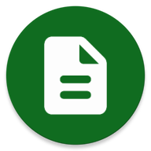
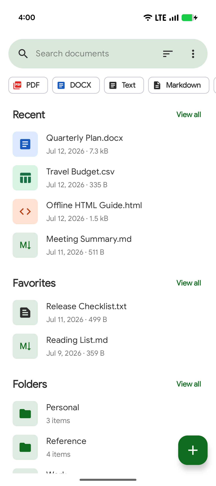
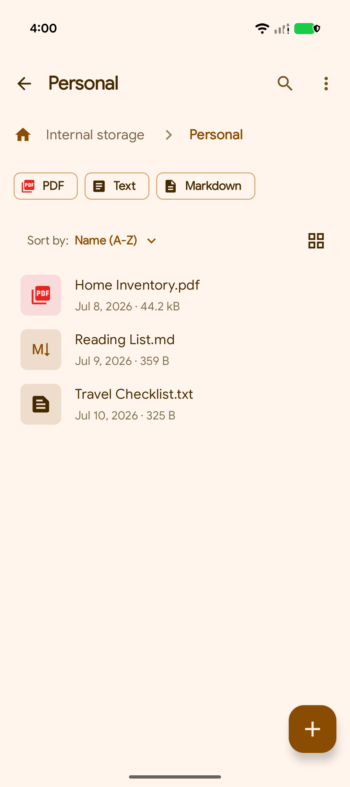
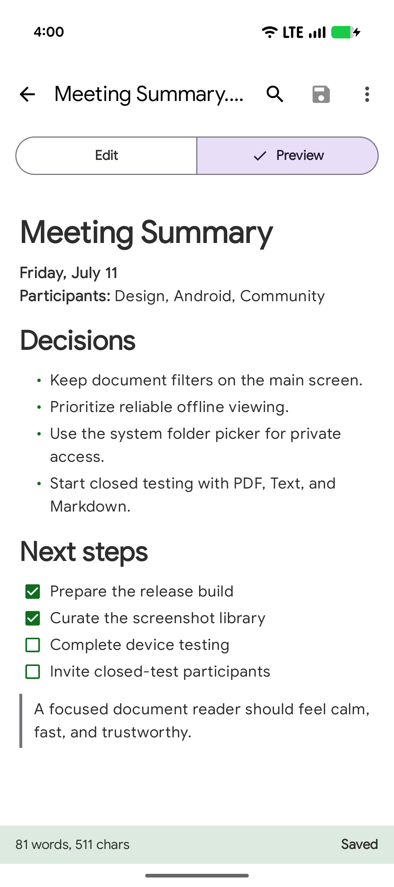

# Fossify Documents

Fossify Documents is a private, offline document reader and organizer for Android.

It supports PDF, DOCX, plain text, Markdown, CSV, and HTML documents. Text,
Markdown, and CSV files can be edited, while DOCX files open in a clean mobile
reading view and CSV files use a dedicated table viewer by default. Documents can
be opened directly, organized through selected folders, searched, filtered, sorted,
and marked as favorites.

The app contains no ads or unnecessary permissions and integrates with Fossify's
shared themes, custom fonts, and appearance settings.

➡️ Explore more Fossify apps: https://www.fossify.org 
➡️ Open-Source Code: https://www.github.com/FossifyOrg 
➡️ Join the community on Reddit: https://www.reddit.com/r/Fossify 
➡️ Connect on Telegram: https://t.me/Fossify

